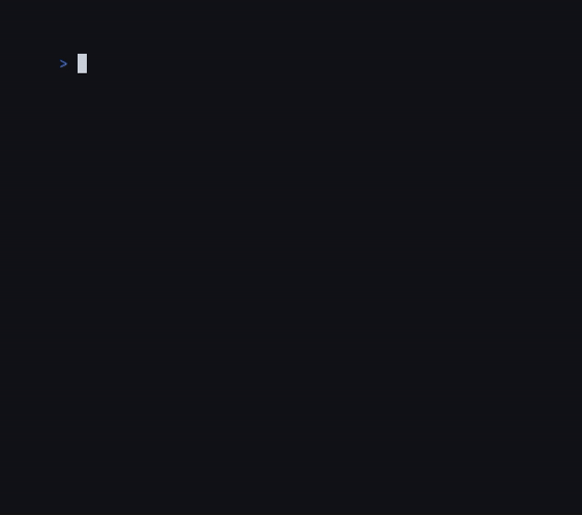

# ♟ Simple CLI chess
    

---
## About

 A simple CLI chess game designed to learn C++
 
 

Development began on December 17, 2025. My C++ studies began with it

---
## Build

Installation scripts may appear in the future, but for now you can build it using CMake:

```
git clone https://github.com/likcoah/simple-cli-chess
cd simple-cli-chess
cmake -B build
cmake --build build
```

The binary file will be in the root bin directory and will be named chess. You can customize the game appearance by modifying files in the `bin/res` and `bin/assets` directories